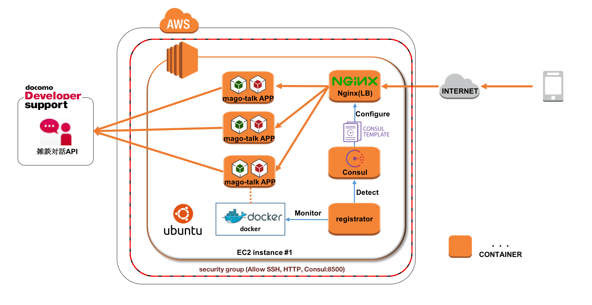

# しゃべるMAGONIA on docker PaaS

@sinohara

2016.1.8

---

# モチベーション

* <p class="fragment">PaaS勉強会で知った技術を使ってみたい</p>
* <p class="fragment">ruby触ってみたい</p>
* <p class="fragment">MAGONIAかわいい</p>

---

# 時間無いのでとっととデモします


---

# 環境の用意

* サーバ借りるところから
* AWS EC2を使用
* OSはubuntu
* セキュリティルール インバウンドのHTTP通信, Consul UI(8500)を許可


---

# セットアップ

```sh
$ wget https://github.com/k-shino/mago-talk/raw/master/setup.sh
$ chmod +x ./setup.sh
$ ./setup.sh
```

## やってること

* dockerのインストール
* docker PaaS(tetsusat氏作成), mago-talk APPのダウンロード


---

# サービスの起動

```sh
$ sudo ./raspaas/bootstrap.sh mago-talk
```

## やってること

* docker PaaSでサービス起動


---

# アプリのデプロイ

```sh
$ cd ./mago-talk/
$ mago-talk create
$ git push mago-talk master
```

## やってること

* git push (gitreceiveでフック)
* pushされたアプリケーションの言語を判断し、ruby環境のdockerイメージを取得
* dockerイメージ上でアプリケーションの実行環境を構築
* dockerコンテナ起動、nginxと接続

---

# mago-talkアプリの概要

* ruby + javascriptで実装
* 雑談対話はdocomo API（四七さんといっしょ）
* MVCフレームワークとしてSinatraを使用
* Ajaxでバックグラウンド更新


---

# できること

* 雑談
* スケール

```sh
$ mago-talk scale web=3
```
* <p class="fragment">時々変なのが紛れ込みます</p>


---

# 最終形


